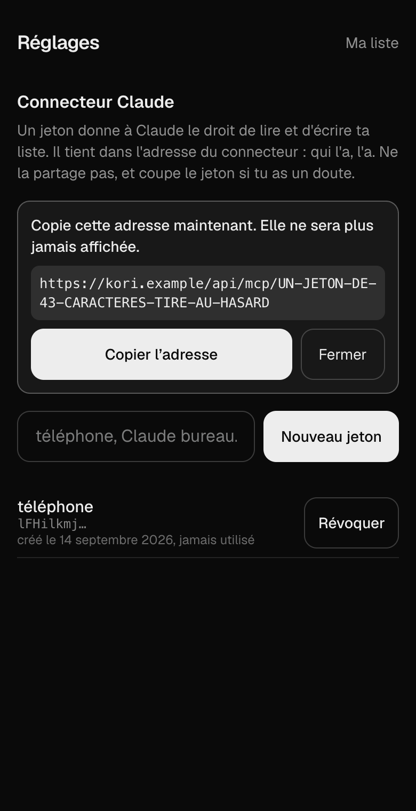

# Kori

Liste de courses bilingue français / finnois, avec un connecteur Claude qui
remplit la liste à partir d'une recette.

Tu saisis en français, la liste affiche le finnois. En rayon, tu ne lis que le
finnois.

Les traductions viennent d'un lexique maison de 286 termes vérifiés contre un
vrai magasin, pas d'un traducteur automatique : `ranskankerma` et non `kerma`
pour la crème fraîche, `rahka` et non `valkoinen juusto` pour le fromage blanc.
Un traducteur générique se trompe régulièrement sur les produits alimentaires,
et ne connaît pas les formats finlandais. Voir la décision D2 du cadrage.

Ce que ce n'est pas : ni prix, ni magasins, ni stocks, ni code-barres, ni import
automatique depuis un site de recettes, ni finnois vers français. Le périmètre
complet, avec ce qui en est exclu et pourquoi, est dans `docs/CADRAGE.md`.

## Ce dépôt est écrit par un agent

Le code, les migrations, les messages de commit, les descriptions de pull
request et l'intégralité de cette documentation — titres et textes compris —
sont écrits et maintenus par **Claude Code**, sous ma direction.

C'est autant le sujet de l'exercice que la liste de courses : voir jusqu'où on
va sur un projet réel, avec un abonnement Claude et rien d'autre.

Deux conséquences pour qui lit :

**La densité des documents n'est pas une coquetterie, c'est le mécanisme.** Le
cadrage, les décisions numérotées et les retours d'expérience existent parce
qu'un agent ne se souvient de rien d'une session à l'autre. Ce qui n'est pas
écrit est perdu, y compris les raisons d'un choix. C'est une contrainte qui a
rendu le projet plus documenté que si je l'avais écrit seul.

**Les décisions restent les miennes, et les erreurs aussi.** Le bug le plus
coûteux du lot M1 — des migrations jamais appliquées à la base hébergée, donc
une application déployée sur un schéma incomplet — n'a été trouvé ni par les
tests, ni par la revue de sécurité, ni par l'agent. Il a été trouvé parce que
j'ai ouvert l'application sur mon téléphone et qu'elle ne marchait pas. C'est
consigné dans `docs/REX-M1.md`.

## État

Lots M0 à M2 terminés : application déployée et installable sur Android,
authentification par lien magique, liste bilingue avec quantités, lexique de
286 termes, et le connecteur Claude qui remplit la liste à partir d'une recette.
Lots M3 et M4 à suivre — le groupement par rayon, l'écran de lexique, le hors
ligne et la réception d'un partage Android.

* `docs/HANDOFF.md` : la mémoire du projet, contexte du cadrage et raisons des choix
* `docs/CADRAGE.md` : problème, périmètre, décisions techniques, modèle de données
* `docs/REX-M0.md` et `docs/REX-M1.md` : retours d'expérience, pièges rencontrés
  et questions ouvertes — à lire avant de reprendre le travail
* `docs/BACKLOG.md` : les vingt et un tickets, par lot
* `docs/tickets/` : un fichier par ticket, source de vérité des issues GitHub

## Stack

Next.js (App Router) déployé sur Vercel, Supabase pour Postgres et
l'authentification, serveur MCP exposé par l'application elle-même.

## Brancher le connecteur Claude

C'est la fonctionnalité qui motive le projet : coller une recette dans Claude et
retrouver les ingrédients dans la liste, en finnois, avant d'aller au magasin.

Le connecteur s'authentifie par un jeton porté dans son adresse (décision D3 du
cadrage). Il n'y a pas de compte à créer côté Claude, pas d'OAuth : on génère un
jeton dans Kori, on colle l'adresse dans Claude, c'est tout.

> **Ce jeton vaut l'accès à ta liste.** Qui a l'adresse peut lire et écrire ta
> liste de courses, sans mot de passe et sans autre vérification. Ne la colle
> nulle part ailleurs que dans les réglages de Claude, ne la mets pas dans une
> capture d'écran, et si tu as un doute, révoque : c'est immédiat, et rien
> d'autre ne casse.

### 1. Générer le jeton dans Kori

Ouvrir **Réglages**, depuis l'en-tête de la liste, puis **Nouveau jeton**. Le
libellé est facultatif : c'est une note pour toi, « téléphone » ou « Claude
bureau », qui te dira six mois plus tard lequel couper.

L'adresse complète s'affiche alors **une seule fois**. Elle n'est stockée nulle
part, pas même en base : Kori n'en garde que l'empreinte. Si tu fermes la
fenêtre sans copier, il n'y a rien à récupérer — il faut en générer un autre.



*Le jeton de cette capture est un gabarit, pas une vraie valeur.*

### 2. Ajouter le connecteur dans Claude

Dans Claude, **Réglages → Connecteurs → Ajouter un connecteur personnalisé**.
Coller l'adresse copiée à l'étape précédente, telle quelle, jeton compris. Le
connecteur ne demande ni identifiant ni autorisation : l'adresse suffit.

Une fois ajouté, il expose neuf outils — et le plus simple pour vérifier que
tout tient est de demander à Claude d'appeler `ping`, qui répond le nom de ta
liste et son nombre de lignes.

| Outil | Ce qu'il fait |
|---|---|
| `ping` | vérifie la chaîne de bout en bout, n'écrit rien |
| `get_list` | la liste complète, avec identifiants, finnois, quantités et rayons |
| `add_items` | ajoute des produits, toute une recette en un appel |
| `check_items`, `uncheck_items` | coche et décoche |
| `remove_items` | retire des lignes |
| `clear_checked` | vide ce qui est déjà acheté |
| `list_missing_translations` | les produits encore affichés en français |
| `add_translation` | ajoute une traduction au lexique, et répare les lignes qui l'attendaient |

### Trois choses à lui demander

**Remplir la liste à partir d'une recette.** Le cas qui justifie tout le reste :

> Voici une recette de carbonara pour quatre : 400 g de spaghetti, 200 g de
> lardons, 4 œufs, 100 g de parmesan, du poivre noir. Ajoute les ingrédients à
> ma liste de courses.

Claude envoie les six produits en un seul appel, au singulier et sans
préparation — c'est ce que la description de l'outil lui demande. Un produit
déjà présent n'est pas dupliqué : sa quantité est mise à jour.

**Compléter le lexique.** Un produit absent du lexique s'ajoute quand même, avec
la mention « traduction manquante ». C'est Claude qui comble le trou :

> Qu'est-ce qui manque en traduction dans ma liste ? Complète le lexique avec
> les noms tels qu'on les trouve en magasin en Finlande, pas la traduction
> littérale.

Les lignes concernées affichent le finnois immédiatement, sans rien toucher à
l'application. Le lexique étant partagé, la traduction profite aussi aux autres
comptes — y compris à leurs lignes déjà saisies.

**Faire le ménage après les courses.**

> J'ai fini mes courses, retire de ma liste tout ce que j'ai coché.

### Couper un jeton

**Réglages**, puis **Révoquer** en face du jeton, deux fois — le bouton demande
confirmation. L'effet est immédiat : l'appel suivant du connecteur reçoit un
refus, sans délai de cache. La ligne reste affichée, barrée, avec sa date : un
jeton révoqué raconte qu'il a existé et quand il a servi la dernière fois.

Deux jetons peuvent coexister, ce qui permet d'en couper un sans se couper
soi-même.

## Développement

```bash
npm install
npm run dev        # http://localhost:3000, contre la base décrite par .env.local
npm run dev:local  # idem, mais contre la pile Supabase locale
npm run build      # build de production
npm run lint       # ESLint
npm run typecheck  # types des routes + tsc --noEmit
npm test           # tests unitaires, lanceur de Node, sans dépendance ajoutée
```

## Base de données en local

La base tourne dans des conteneurs. Sur macOS, Docker suppose une machine
virtuelle Linux : Colima en fournit une sans interface graphique.

```bash
brew install colima docker supabase/tap/supabase
colima start --cpu 4 --memory 5 --disk 20

supabase start -x realtime,storage-api,imgproxy,studio,edge-runtime,logflare,vector,supavisor,postgres-meta
npm run db:reset                 # rejoue toutes les migrations sur une base vide
npm run db:test                  # isolation entre comptes et politiques RLS
npm run db:test:provisionnement  # profil et liste créés, et nettoyés à la suppression
```

Le collecteur de mails n'est plus exclu : sans lui, aucun lien magique n'arrive
et l'authentification est invérifiable en local. Il s'ouvre sur
http://127.0.0.1:54324.

Les services exclus ne servent pas encore et la pile complète ne tient pas dans
5 Go de RAM. `colima stop` rend la mémoire, `colima start` la reprend sans
retélécharger.

Le lexique initial s'importe depuis `data/terms.csv` :

```bash
npm run seed:terms:local   # vers la base locale
npm run seed:terms         # vers la base décrite par .env.local
```

Le script est idempotent : une seconde exécution n'insère rien. Il annonce en
clair l'hôte qu'il vise avant d'écrire, parce qu'il écrit.

`supabase/tests/isolation.sql` s'exécute dans une transaction annulée à la fin :
il ne laisse aucune donnée derrière lui, y compris si on le colle dans l'éditeur
SQL d'une base réelle.

## Migrations et base hébergée

Vercel déploie le code sur push. **Il ne déploie pas le schéma.** Les deux
partaient donc en décalé, et rien ne le signalait : l'application se déployait
en vert sur une base qui n'avait pas encore la table ou le déclencheur qu'elle
attendait. Le récit est dans `docs/REX-M1.md`.

Depuis, le workflow `.github/workflows/migrations.yml` les applique à la fusion
sur `main`. Il ne se déclenche jamais sur une pull request : le dépôt est
public, une pull request exécute le code de son auteur, et un workflow qui
détient les identifiants de la base ne doit tourner que sur du code déjà
accepté.

Il lit un seul secret, `SUPABASE_DB_URL`, rangé dans l'environnement GitHub
`supabase` plutôt que dans le dépôt. Deux choses à savoir : la chaîne doit être
celle du **pooler en mode session**, les machines de GitHub n'ayant pas d'IPv6 ;
et comme elle contient le mot de passe de la base, **réinitialiser ce mot de
passe casse le workflow** tant que le secret n'est pas remis à jour.

Deux garde-fous, dans cet ordre :

**Le contrôleur de migrations destructrices** refuse ce qui peut perdre des
données — suppression de table ou de colonne, vidage, `delete` ou `update` sans
condition — y compris à l'intérieur d'un corps de fonction. Il tourne d'abord
sur les pull requests, pendant qu'on peut encore en discuter, puis à nouveau
avant que le workflow n'ouvre la moindre connexion.

```bash
npm run migrations:verifier
```

Pour faire passer une suppression voulue, il faut la signer dans le fichier :

```sql
-- kori:destructif <pourquoi cette perte est voulue>
```

Ce n'est pas un contournement, c'est une signature : elle reste dans le fichier,
et elle sera lue le jour où quelqu'un cherchera pourquoi ces données ont
disparu. La désactivation de RLS, elle, n'a pas d'échappatoire — la règle 3 est
sans exception.

**Et rien n'est appliqué à moitié.** Postgres exécute chaque migration dans une
transaction : une faute de syntaxe ou une contrainte violée annule tout le
fichier et ne laisse aucune trace. Le danger n'est donc pas la migration cassée,
c'est celle qui fonctionne parfaitement et fait la mauvaise chose — d'où le
contrôleur.

En local, ou pour reprendre la main :

```bash
npx supabase db push --dry-run        # ce qui partirait
npx supabase migration list --linked  # local et distant doivent coïncider
```

Et vérifier le comportement, pas seulement la liste : une migration appliquée
ne prouve pas qu'un déclencheur se déclenche.

## Hygiène des secrets

Le repo est public : aucune clé ne doit y entrer. Un hook de pré-commit lance
`gitleaks` sur les fichiers indexés. Le chemin des hooks n'étant pas cloné avec
le repo, il faut l'activer une fois après un clone :

```bash
git config core.hooksPath .githooks
brew install gitleaks   # sinon le hook avertit et laisse passer
```

Les variables d'environnement attendues sont listées dans `.env.example`, à
copier en `.env.local`. `src/lib/env.ts` les valide au démarrage et interdit la
lecture de la clé de service Supabase depuis le navigateur.

## Peupler les issues GitHub

```bash
gh auth login
node scripts/bootstrap-github.mjs axelvallier/kori
```

Le script crée les labels, les milestones et les issues à partir de
`docs/tickets/`. Il peut être relancé sans créer de doublon.

## Licence

MIT, voir `LICENSE`.

Le lexique de `data/terms.csv` est couvert par la même licence : reprends-le,
corrige-le, redistribue-le. C'est la partie de ce dépôt la plus susceptible de
servir à quelqu'un d'autre — 286 termes de courses français → finnois, avec le
rayon, vérifiés en magasin plutôt que traduits automatiquement.
